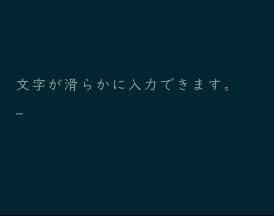
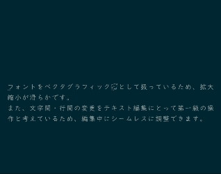
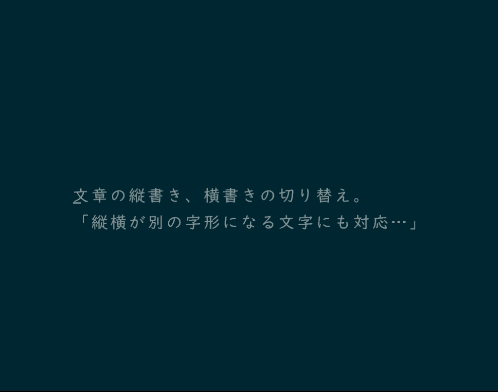
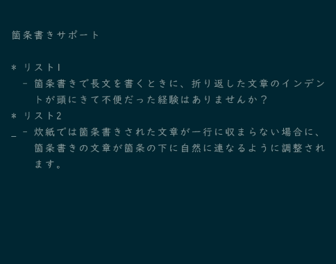
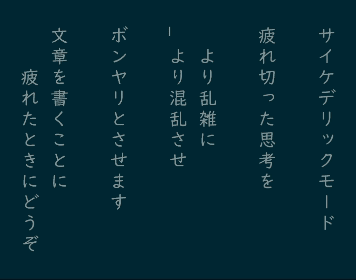
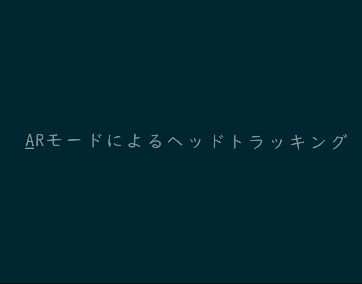
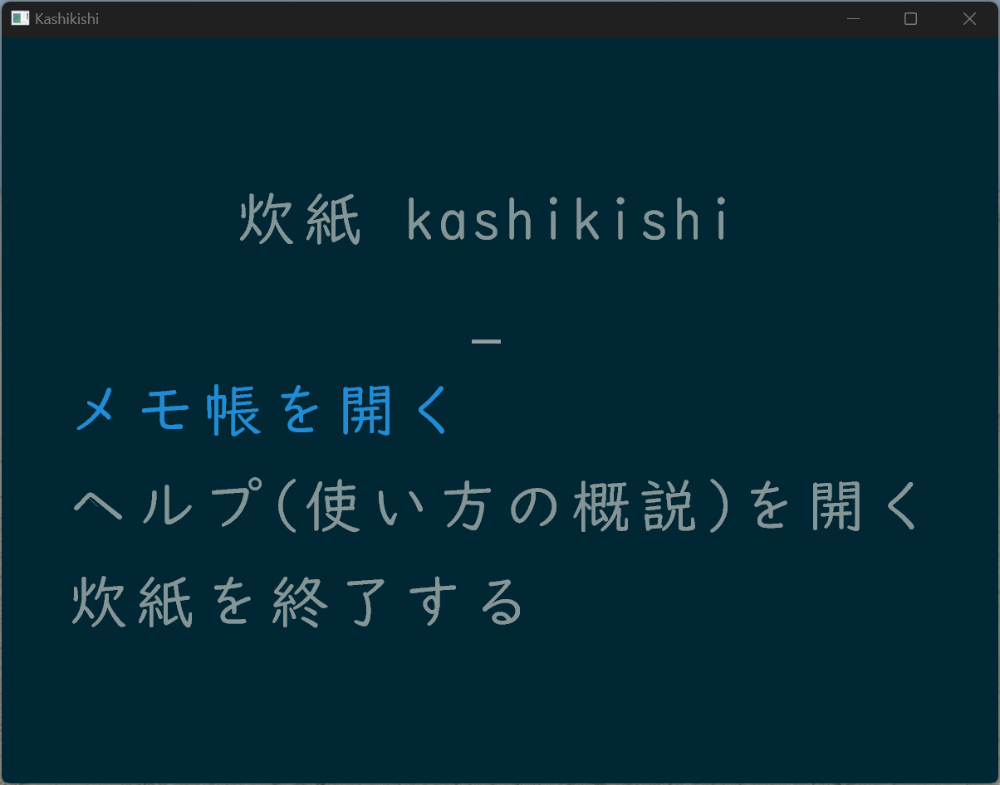

# 炊紙 kashikishi

炊紙は三次元空間上でテキストを編集できるテキストエディタです。「かしきし」と発音します。

Rust & WebGPU(wgpu) で開発されてます。

> [!NOTE]
> この README 文書のオリジナルは GitHub 上で管理されています。
> https://github.com/mitoma/kashiki2

> [!WARNING]
> このソフトウェアは現在開発中のため破壊的な仕様変更が随時入ります。

## モチベーション

世のテキスト編集は未だに貧相なユーザーインタフェイスを引きずったままです。  
例えば "A" というキーを押せば何のインタラクションもなく "A" という文字が突如画面に登場し、"Delete" を押せば瞬く間に消え去ってしまいます。  
カーソルは画面の右端に消えたかと思えばいきなり左端に登場します。

このAR/VR時代、文字列という一次元のバイト列がいつまでも紙の時代を踏襲して二次元空間にレイアウトされ、貧しいインタラクションで表現される前提ではいけません。  
文章は三次元空間上に自由に、滑らかにレイアウトされるべきでしょう。(確たる根拠なし)

炊紙ではこのような考え方に基づき、三次元空間上でテキストを編集するユーザーインタフェイスの価値検証を目的に開発されています。

## 特徴

炊紙は内部的に三次元空間上にテキストを配置しているため以下のような特徴を備えています。

### 文書編集の各種操作が滑らか

フォントの描画を GPU 側で行い、イージング関数に基づいたアニメーションを行い既存のテキストエディタにはない滑らかな編集体験を実現しています。

2024年時点の PC であれば多くの環境で 60fps で動作する見込みです。



### 拡大縮小、文字・行間の調整がシームレス

フォントをベクタグラフィックとして扱っているため、拡大縮小が滑らかです。  
また、文字間・行間の変更をテキスト編集にとって第一級の操作と考えているため、編集中にシームレスに調整できます。 



### 縦書きができる

日本語は縦書きが基本ですが、十分に縦書きに対応したテキストエディタは多くはありません。  
しかし、文章は縦に見たり横に見たり、レイアウトを柔軟に変えて読み直すことで深い洞察を得ることができます。  
炊紙では文書編集中に縦書き、横書きを即座に切り替えられます。



### 箇条書き

箇条書きを入力すると自動的にインデントが付きます。  
これは単に私の文章編集上の好みに過ぎません。



### (実験的)サイケデリックモード

投げやりな気分の時にはサイケデリックモードを有効にしてみてください。



### (実験的)ARモード

[Rokid Max](https://jp.rokid.com/products/rokid-max) という AR デバイスを所有していて Windows を利用している場合に限り、AR モードを有効にできます。  
ヘッドトラッキングにより、より三次元空間を活かしたテキスト編集体験ができます。



### Emacs like なキーバインド

炊紙は Emacs のキーバインドをベースにしています。  
これは非常に深い思索・検討の末に至った合理的理由がありますがドキュメント上は単に私の好みとしておきます。

## インストールやビルドの方法

> [!WARNING]
> 炊紙は現在 Windows でのみ動作を確認しています。  
> Linux や Mac ではビルドのみ行っていますが期待通り動作するかは確認・保障されていません。

### Releases からダウンロード

https://github.com/mitoma/kashiki2/releases から最新のリリースをダウンロードしてご利用ください。  
Windows では動作確認を行っていますが、Linux や Mac では動作確認を行っていません。

### cargo によるインストール

```sh
cargo install --git https://github.com/mitoma/kashiki2.git kashikishi
```

### リポジトリを clone して実行

```sh
git clone https://github.com/mitoma/kashiki2.git
cd kashiki2
cargo run --bin kashikishi --release
```

#### Windows でのビルドの注意点

Windows でビルドを行う際、環境によっては 'error: linker `link.exe` not found' というエラーが表示されることがあります。  
この場合 Build Tools for Visual Studio 2022 をインストールし、C++によるデスクトップ開発用のツールをインストールすることで多く環境で問題を解決できるでしょう。  
https://visualstudio.microsoft.com/ja/downloads/

#### Linux でのビルドの注意点

Linux でビルドを行う際に `libudev` が必要になる場合があります。  
Ubuntu であれば以下のコマンドでインストールできます。

```sh
sudo apt-get install libudev-dev
```

## 使い方

炊紙は起動すると以下のような画面が表示されます。



メモ帳を使う場合はそのままEnterキーを押してください。  
使い方を知りたい場合はカーソルを下に動かしてヘルプを選んでEnterキーを押してください。

炊紙はまだ手軽なメモ帳としての機能しか無く、任意のファイルを開いて編集する機能はありません。メモは json ファイル形式で以下のファイルに構造化されて保存されます。

```sh
$HOME/.config/categorized_memos.json
```

$HOME は Windows の場合、典型的には以下のパスになります。

```sh
C:\Users\[ユーザー名]
```

また、バックアップファイルは `categorized_memos.[バックアップ日時].json` の形式で都度保存され、炊紙では明示的な削除は行いません。ただのメモ帳であることから、そこまで大規模なデータ量になる事はありませんが、必要に応じてバックアップファイルは適宜削除ください。

メモ帳の内容を明示的に保存したい場合は `Ctrl + X` `Ctrl + S` のキーバインドで保存できます。

## コントリビューション

炊紙はソフトウェアを利用したフィードバックや三次元空間上でテキスト編集するためのアイデアや議論について歓迎します。  
ただし、PullRequestなどソースコードでのコントリビューションについては現在受け付けていません。  
ソフトウェアに改変を加えたい場合は適宜フォークしていただき、ライセンスに従ってご利用ください。

## ライセンス

炊紙は MIT ライセンスの下で公開されています。[ref](LICENSE)

### 利用フォントについて

炊紙はシステムに「UD デジタル 教科書体」が含まれる場合はそちらを優先的に利用します。  
UD デジタル 教科書体が利用できない場合は組み込みのフォントを利用します。  
組み込みのフォントは以下の2点を利用しており、いずれも Open Font License に従った利用に努めています。

#### BIZ UD明朝

読みやすくバランスの良いフォント

https://fonts.google.com/specimen/BIZ+UDMincho/about

#### Noto Emoji

かわいい白黒の絵文字フォント

https://fonts.google.com/noto/specimen/Noto+Emoji
